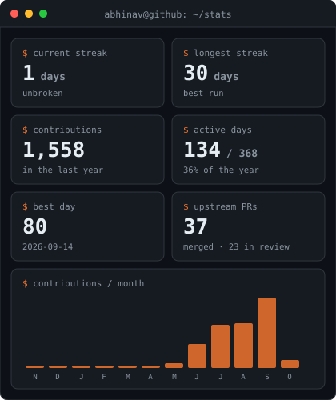
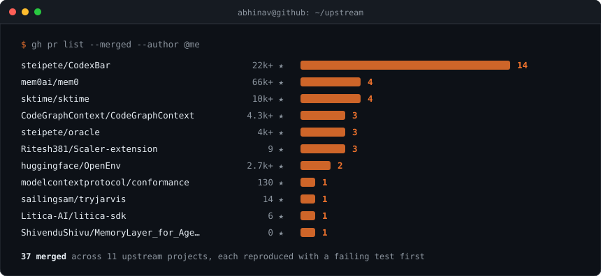

<!-- every svg below is regenerated daily from the GitHub API by
     .github/workflows/live-update.yml — nothing here is hand-written -->

<h3><code>abhinav@github ~ $ ./contributions.sh</code></h3>

 
 

<h3><code>abhinav@github ~ $ whoami</code></h3>

<table>
<tr>
<td valign="top"></td>
<td valign="top"></td>
</tr>
</table>

 
 

<h3><code>abhinav@github ~ $ ./upstream.sh</code></h3>

<!--START:upstream-headline-->
  <samp><a href="https://github.com/steipete/CodexBar">CodexBar</a> 14 · <a href="https://github.com/mem0ai/mem0">mem0</a> 4 · <a href="https://github.com/sktime/sktime">sktime</a> 4 · <a href="https://github.com/CodeGraphContext/CodeGraphContext">CodeGraphContext</a> 3 · <a href="https://github.com/steipete/oracle">oracle</a> 3 · +6 more</samp> 
  <a href="https://github.com/pulls?q=is%3Apr+is%3Amerged+author%3AOfficialAbhinavSingh">browse all 37 merged pull requests →</a>
<!--END:upstream-headline-->

 
 

<h3><code>abhinav@github ~ $ ./links.sh</code></h3>

<b>AI/ML and Agentic Systems · Open Source Contributor · Arch Linux</b>

 

